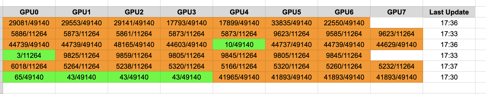

# gpu_monitor
Nvidia gpu monitoring tool based on Python gspread library



## Last Update (June 4, 2024)
> Included an example image

> How to run

### TODO
1. Support docker environment

## Getting Started
Before getting started, you need to get google spreadsheet auth token (refer to the link below)

https://docs.gspread.org/en/latest/


1. Install dependencies
```sh
pip install -r requirements.txt
```

2. Modify the config.yaml file
- --`json_path`: Auth token from google spreadsheet API
- --`start_cell`: Starting cell for loggin gpu stats
- --`num_gpus`: The number of total gpus in node
- --`sleep_time`: sleeping time between each API call (to prevent API limit exceed)
- --`spreadsheet_name`: Name of spreadsheet document
- --`worksheet_name`: Name of worksheet (see bottom left)

3. Run the monitoring using the script below
```sh
./run.sh
```

or 

```sh
python watch.py --config_path CONFIG_PATH
```